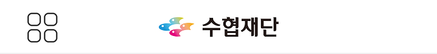
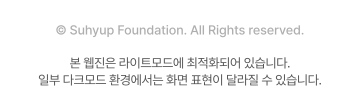
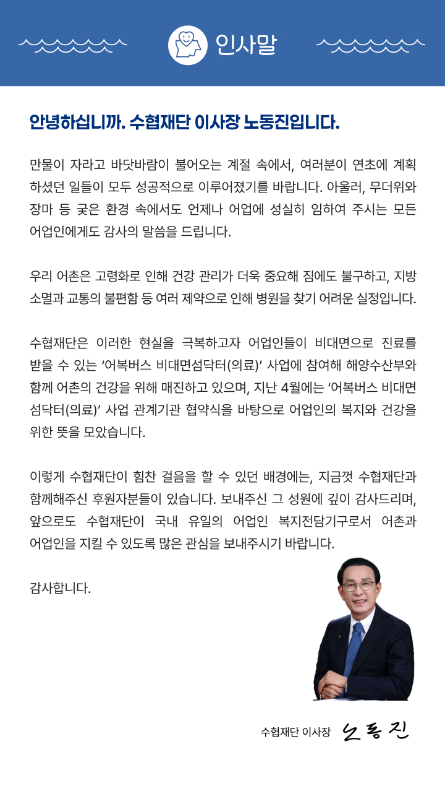
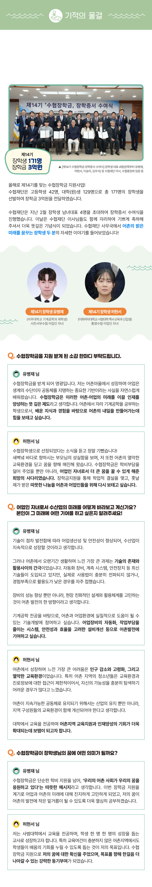
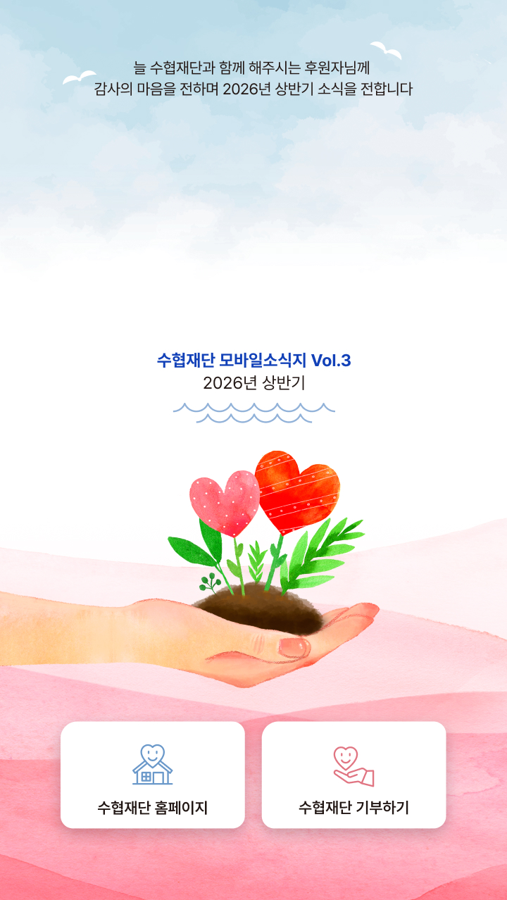
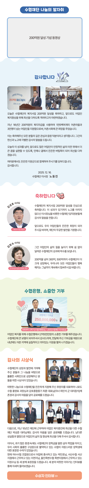

# 수협재단 모바일 웹진 발행 가이드

이 문서는 지금까지 작업한 "수협재단 모바일소식지" 웹진 프로젝트의 구조와 작업 방식을 정리한 자료입니다. 다음에 이어받는 사람(혹은 미래의 나 자신)이 이 문서만 보고도 새 호를 발행하고, 페이지를 수정하고, 문제를 해결할 수 있도록 작성했습니다.

배포 사이트: `fecwfnewsletter.openusforearth.workers.dev` (Cloudflare Workers/Pages)

---

## 1. 프로젝트 한눈에 보기

이 웹진은 빌드 도구나 프레임워크 없이 **순수 HTML/CSS/JS로만** 만들어져 있습니다. 모바일 화면에서 좌우로 스와이프하며 넘겨보는 "카드뉴스형 소식지" 형태입니다.

```
webzine/
├── index.html          ← 항상 "최신호"를 보여주는 페이지 (고정 주소)
├── vol2.html            ← Vol.2 고정 주소 (과월호, 발행 후 내용 수정 안 함)
├── vol3.html            ← Vol.3 고정 주소 (현재 최신호)
├── css/
│   ├── reset.css        ← 브라우저 기본 스타일 초기화
│   └── style.css        ← 사이트 전체 스타일 (핵심 파일)
├── js/
│   └── main.js          ← 스와이프/목차/버튼 등 모든 동작 로직 (핵심 파일)
└── images/
    ├── header.jpg, footer.svg, suhyup_logo.svg   ← 공통 자산 (모든 호 공용)
    ├── btn_left.svg, btn_right.svg                ← 좌우 이동 버튼 아이콘
    ├── 1p.jpg, 2p.jpg, ... (Vol.2 이미지, images/ 루트에 있음)
    └── 2026_H1/                                    ← Vol.3 전용 이미지 폴더
        ├── cover_img.jpg, cover_title.jpg
        ├── 1p.jpg, 2p.jpg, ...
        └── N p_img.jpg / Np_title.png(jpg)          ← 제목 분리형 페이지들
```

**중요**: 새 호를 만들 때마다 이미지를 그 호수 전용 폴더(`images/2026_H1/` 같은)에 넣는 걸 권장합니다. Vol.2는 처음에 이런 규칙 없이 시작해서 `images/` 루트에 섞여 있습니다.

---


## 2. 발행 규칙 (가장 중요)

> 원본 체크리스트: `웹진_발행_체크리스트.md` (Downloads 폴더에 있던 파일, 이 프로젝트에서 처음 확정했던 규칙 — **지난호 부분은 아래 내용으로 업데이트됨**)


| 파일           | 역할                                               |
| ------------ | ------------------------------------------------ |
| `index.html` | 항상 **최신호**를 보여줌 (내용은 최신 `volN.html`과 완전히 동일해야 함) |
| `volN.html`  | 각 호수의 **고정 주소**. 한 번 발행되면 내용을 수정하지 않음            |


### "지난호" 버튼은 외부 사이트로 연결 (archive.html 폐지됨)

원래는 사이트 안에 `archive.html`이라는 지난호 목록 페이지를 따로 두고 있었지만, **삭제했습니다**. 대신 헤더의 "지난호" 버튼과 각 호 마지막 페이지의 "지난 호 바로가기" 버튼 모두 수협재단 공식 사이트로 바로 연결됩니다.

```html
<a href="https://fecwf.or.kr/community/newsletter.html">지난호</a>
```

이 링크는 `index.html`, `vol2.html`, `vol3.html` — **모든 호에 공통으로** 들어가 있습니다 (nav의 "지난호"와, 각 호 마지막 페이지의 "지난 호 바로가기" 링크 둘 다). 새 호를 만들 때도 이 값 그대로 복사하면 됩니다. 즉 웹진 자체적으로는 더 이상 과거 호 목록을 따로 관리하지 않습니다.

### 새 호(N호) 발행 절차

1. `volN.html` 파일을 새로 만들고 이번 호 콘텐츠를 입력 (nav의 "지난호"·"지난 호 바로가기" 링크는 위 외부 주소 그대로 유지)
2. GitHub 저장소에 업로드 (Add file → Upload files → Commit)
3. `volN.html`의 내용을 그대로 복사해서 `index.html`에 덮어쓰기 (파일명은 유지, 내용만 교체 — `<title>`과 nav의 "최신호" 링크만 아래처럼 다르게 유지)
4. Cloudflare가 자동 재배포 (커밋 후 1분 이내) → 실제 사이트에서 확인
5. 최종 점검: index에 최신호가 뜨는지, "지난호" 버튼이 외부 사이트로 정상 연결되는지, 새 volN.html이 안 깨졌는지


### `index.html`과 `volN.html`의 유일한 차이

`index.html`은 "최신호" 탭이 자기 자신이므로:

```html
<title>수협 웹진</title>
...
<a href="#" class="is-active">최신호</a>
```

`volN.html`(고정 주소)은 최신호가 아닐 수도 있으므로 항상 index로 링크:

```html
<title>수협 웹진 Vol.3</title>
...
<a href="index.html">최신호</a>
```

그 외 `<body>` 내용은 **완전히 동일**해야 합니다. (`diff index.html vol3.html`로 항상 확인 가능)

---


## 3. 페이지 마크업 구조

모든 웹진 페이지는 `<main class="webzine-track" id="webzine-track">` 안에 가로로 나열된 `<section class="page">` 들입니다. `scroll-snap`으로 한 장씩 스와이프되고, 각 페이지 내부는 세로 스크롤이 가능합니다 (이미지가 화면보다 길 때).

### 기본 뼈대 (모든 페이지 공통)

```html
<section class="page">
  
  <!-- 여기에 페이지별 본문 (아래 4가지 패턴 중 하나) -->
  
</section>
```

- `.page-header`: 상단에 항상 붙어있는 그리드 아이콘+로고 배너 (sticky, 스크롤해도 안 사라짐)
- `.page-footer`: 페이지 맨 아래 저작권 문구 (스크롤해야 보임)


### 본문 패턴 4가지

**① 단순 이미지 (분리/모션 없는 페이지)**

```html

```

**② 제목 분리 + 페이드인 모션 (title-frame)**
디자이너가 제목 텍스트를 별도 이미지로 분리해서 준 경우 사용. 페이지에 처음 진입할 때마다 제목이 위로 슬라이드하며 페이드인.

```html
<div class="title-frame page-main" style="aspect-ratio: 720 / 4162;">
  
  
</div>
```

- `aspect-ratio`는 `배경이미지 원본 가로 / 세로` (예: 720/4162)
- `left/top/width`는 원본 이미지에서 제목이 있던 위치를 %로 계산 (아래 6번 섹션 참고)

**③ 표지 (cover-media)**
표지는 클릭 가능한 버튼(홈페이지/기부하기)이 이미지 위에 얹혀 있어서 구조가 조금 다릅니다.

```html
<div class="cover-media page-main">
  
  
  <div class="cover-links">
    <a href="https://fecwf.or.kr/main/main.html" class="cover-link cover-link--home" target="_blank" rel="noopener noreferrer">
      <span class="visually-hidden">수협재단 홈페이지</span>
    </a>
    <a href="https://secure.donus.org/shfoundation/pay/step1" class="cover-link cover-link--donate" target="_blank" rel="noopener noreferrer">
      <span class="visually-hidden">수협재단 기부하기</span>
    </a>
  </div>
</div>
```

(제목 분리가 없는 표지는 `.page-title` 줄만 빼면 됩니다.)

**④ 유튜브 영상 삽입 (media-embed)**

```html
<div class="media-embed page-main">
  
  <div class="media-embed__frame">
    <iframe src="https://www.youtube.com/embed/영상ID" title="..." frameborder="0"
            allow="accelerometer; autoplay; clipboard-write; encrypted-media; gyroscope; picture-in-picture; web-share"
            allowfullscreen></iframe>
  </div>
</div>
```


### 이미지 안의 버튼을 실제 클릭 가능하게 만들기 (이미지맵)

디자인 이미지 안에 "기부하러 가기" 같은 버튼이 그림으로 그려져 있을 때, 그 위에 투명한 링크를 얹는 방식입니다.

**외부 링크로 이동:**

```html
<a href="https://외부주소" class="page-link" target="_blank" rel="noopener noreferrer"
   style="left: 7.778%; top: 29.323%; width: 83.75%; height: 2.799%;">
  <span class="visually-hidden">버튼 설명</span>
</a>
```

**웹진 내 다른 페이지로 이동:**

```html
<a href="#" class="page-link" data-goto-page="9"
   style="left: 8.056%; top: 96.589%; width: 83.75%; height: 1.706%;">
  <span class="visually-hidden">수상자 인터뷰</span>
</a>
```

`data-goto-page`는 이동할 페이지의 **0부터 시작하는 인덱스** (표지=0, 첫 내지=1, ...). `main.js`가 클릭을 감지해서 자동으로 그 페이지로 스와이프 이동시킵니다.

이 두 종류의 `<a>`는 반드시 `title-frame`, `cover-media`, `media-embed` 처럼 `position: relative`**가 걸린 부모 요소 안**에 있어야 좌표가 정확히 맞습니다.

---


## 4. 공통 기능 (main.js)


| 기능         | 설명                                                                        |
| ---------- | ------------------------------------------------------------------------- |
| 좌우 스와이프    | `scroll-snap`으로 자연스럽게 한 장씩 넘어감 (터치/트랙패드 기본 동작, JS 개입 최소화)                 |
| 페이지 인디케이터  | 우측 하단 "3 / 15" 표시, 스크롤 위치로 자동 계산                                          |
| 좌우 화살표 버튼  | `#page-nav-prev` / `#page-nav-next`, 첫/마지막 페이지에서 자동으로 숨김 (`display:none`) |
| 키보드 화살표    | ←→↑↓ 키로도 페이지 이동 가능                                                        |
| 제목 페이드인 모션 | 현재 보이는 페이지에 `is-active` 클래스를 토글 → `.page-title`이 opacity/transform 트랜지션   |
| 목차(미리보기)   | 좌측 상단 그리드 아이콘 클릭 → 전체 페이지 썸네일 그리드, 클릭 시 해당 페이지로 이동 (아래 5번 참고)             |
| 이미지맵 버튼    | `.page-link` 클릭 감지, `data-goto-page` 있으면 내부 이동, 없으면 일반 링크로 동작             |


### 목차(TOC) 기능 작동 원리

`main.js`의 `buildToc()`가 **이미 화면에 있는 각** `.page` **섹션을 그대로 읽어서** 썸네일을 자동 생성합니다. 즉 새 페이지를 추가해도 목차 코드를 따로 안 건드려도 됩니다.

- 배경 이미지: `.title-frame__bg` → `.cover-media > img` → `.media-embed > img` → `img.page-main` 순서로 찾아서 사용
- 제목: `.page-title`이 있으면 그 이미지도 같이 얹고, 원본의 `top%`를 **썸네일 박스 기준(위에서 960px 크롭)으로 재계산**해서 위치를 맞춤
- `.page.page-end`(마지막 "지난 호 보기" 페이지)는 목차에서 제외


### PC 화면에서 "앱 카드" 프레임으로 보이게 하기

모바일 전용으로 만든 웹진이라, PC의 넓은 화면에서는 내용이 옆으로 쭉 늘어나 보기 불편했습니다. 그래서 **641px 이상 화면(PC)에서는 폭 430px짜리 카드를 화면 가운데 띄우고 양옆을 회색 배경으로 채우는** 방식으로 처리했습니다 (`style.css` 맨 아래쪽 `@media (min-width: 641px)` 블록).

이 작업 때문에 좌우 이동 버튼, 목차 버튼, 페이지 인디케이터처럼 화면에 고정으로 떠 있는 요소들을 `position: fixed`**(브라우저 기준) 대신** `position: absolute`**(카드 기준)로 전부 바꿨습니다.** 그리고 `.wrapper`에 `container-type: inline-size`를 줘서, 목차 버튼 좌표 계산에 쓰던 `vw`(뷰포트 기준) 단위를 `cqw`(카드 기준) 단위로 바꿨습니다.

**앞으로 화면에 고정으로 떠 있는 요소를 새로 추가할 때 주의할 점**: `position: fixed`를 쓰면 PC에서 카드 밖 회색 배경 쪽에 엉뚱하게 붙어버립니다. 반드시 `position: absolute`로 만들고, `.wrapper`(`position: relative`가 걸려있음) 기준으로 좌표를 잡아야 합니다.

- 640px 이하(모바일)는 원래처럼 전체 화면을 그대로 씁니다 (변경 없음)

---


## 5. 이미지 속 좌표(%) 계산하는 법

디자이너가 준 이미지에서 제목이나 버튼 위치를 %로 뽑아낼 때 쓴 방법입니다. Python + Pillow(PIL) 사용.

**제목 분리 이미지가 있을 때 (원본 vs** `_img` **비교):**

```python
from PIL import Image, ImageChops
import numpy as np

a = Image.open('원본.jpg').convert('RGB')
b = Image.open('제목빠진.jpg').convert('RGB')
diff = np.array(ImageChops.difference(a, b))
mask = diff.sum(axis=2) > 40
ys, xs = np.where(mask)
print(xs.min(), xs.max(), ys.min(), ys.max())  # 제목이 있던 좌표 범위
```

`_title` 파일 자체의 width/height를 diff 결과의 좌상단 좌표와 조합해서 정확한 box를 만듭니다 (diff bbox보다 title 파일 자체 크기가 더 정확함).

**버튼처럼 특정 색상 영역을 찾을 때:**

```python
from PIL import Image
im = Image.open('이미지.jpg').convert('RGB')
px = im.load()
# 버튼의 대표 색상을 먼저 한 두 픽셀 찍어서 확인한 뒤
def close(p, target, tol=12):
    return all(abs(p[i]-target[i]) <= tol for i in range(3))
# 해당 색상 범위의 x/y 최소·최대값을 스캔
```

**% 변환 공식:**

```
left%   = x / 이미지가로
top%    = y / 이미지세로
width%  = (x최대-x최소) / 이미지가로
height% = (y최대-y최소) / 이미지세로
```

계산 후 항상 크롭해서 스크린샷으로 원본과 대조 확인했습니다 (Read 툴로 잘라낸 영역이 진짜 비어있는지 / 버튼과 정확히 겹치는지).

---


## 6. 겪었던 문제와 해결 기록 (트러블슈팅)


### "이미지가 안 보여요"

→ 십중팔구 **파일 업로드 누락**. 코드(html/css/js)는 올렸는데 실제 이미지 파일이나 새로 만든 폴더(`images/2026_H1/` 등)를 GitHub에 안 올린 경우가 대부분이었음. 브라우저 네트워크 탭에서 404 확인하면 바로 원인 나옴.

### "코드를 고쳤는데 사이트에는 반영이 안 돼요"

→ **브라우저/CDN 캐시**. `css/style.css`, `js/main.js`는 내용이 바뀌어도 파일명이 같아서 캐시된 예전 버전을 계속 쓸 수 있음. 그래서 항상 `style.css?v=12`, `main.js?v=7` 처럼 **버전 쿼리 파라미터를 붙여서** 새 파일을 강제로 받아오게 함. 파일을 고칠 때마다 버전 숫자를 1씩 올리는 걸 잊지 말 것.

### "안드로이드에서 페이지 안 세로 스크롤이 안 돼요"

→ 가로 스와이프 컨테이너(`.webzine-track`)와 세로 스크롤 컨테이너(`.page`)가 겹쳐 있을 때, 터치 제스처 방향을 브라우저가 못 정하는 경우가 있음. `touch-action: pan-x`(트랙)/`touch-action: pan-y`(페이지)를 명시해서 해결.

### "제목/버튼 위치가 안 맞아요"

→ 대부분 % 계산 기준을 잘못 잡은 경우. `title-frame`/`cover-media`/`media-embed`는 모두 `position: relative`이고 그 자식의 `position: absolute` 좌표는 **그 부모 박스 기준 %** 이므로, 부모가 표시되는 실제 렌더링 사이즈(원본 이미지와 동일 비율)를 기준으로 계산해야 함.

### "썸네일에서 제목이 이상한 위치에 있어요"

→ 목차 썸네일은 원본 이미지의 **위에서 960px만 크롭**해서 보여주므로 ( `TOC_CROP_HEIGHT` in main.js), 원본 `top%`를 그대로 쓰면 안 되고 `top% × 원본세로px ÷ 960 × 100`으로 재계산해야 함 (이미 `main.js`에 구현되어 있어서 새 페이지 추가 시 따로 손댈 필요 없음).

---


## 7. 자주 하는 작업 요약


| 하고 싶은 것        | 방법                                                                           |
| -------------- | ---------------------------------------------------------------------------- |
| 새 호 발행         | 2번 섹션의 절차대로 `volN.html` 생성 → `index.html` 덮어쓰기 (지난호 링크는 외부 주소 그대로 유지)        |
| 페이지 이미지 교체     | `` 의 `src`만 바꾸면 됨. 캐시가 걱정되면 `?v=2` 같은 쿼리 추가                             |
| 제목에 모션 넣기      | 3번 섹션 "② 제목 분리" 패턴으로 마크업 변경 (디자이너에게 `_img`/`_title` 분리 파일 요청)                |
| 이미지 속 버튼 살리기   | 3번 섹션 "이미지맵" 방식으로 `.page-link` 추가, 좌표는 5번 섹션 방법으로 계산                         |
| 유튜브 영상 삽입      | 3번 섹션 "④ media-embed" 패턴 사용                                                  |
| 새 페이지 추가       | 기존 `<section class="page">` 블록 하나를 복사해서 원하는 위치에 붙여넣기 (header/footer는 그대로 유지) |
| CSS/JS 수정 후 배포 | 반드시 `?v=` 버전 숫자 올리는 것 잊지 않기                                                  |


---


## 8. 아직 안 끝난 것 / 참고 사항

- `images/` 루트의 Vol.2 이미지들과 `images/2026_H1/`(Vol.3) 폴더 이름 규칙이 서로 다름 — 다음 호부터는 처음부터 `images/2026_H2/` 같은 폴더를 만들어서 정리하는 게 좋음
- git 커밋 이력이 없는 상태로 로컬 작업만 되어 있었음(`git status` 기준) — GitHub 업로드는 지금까지 웹 UI로 수동 드래그 업로드 방식으로 진행. 필요하면 git 저장소로 전환해서 버전 관리하는 것도 고려해볼 만함
- `archive.html`**은 삭제됨.** 처음에는 "지난호" 목록을 웹진 안에서 자체적으로 관리하려 했지만(카드 목록 페이지), 이후 수협재단 공식 사이트(`fecwf.or.kr/community/newsletter.html`)에 이미 지난호 아카이브가 있어서 그쪽으로 연결하는 걸로 방향을 바꿨습니다. 혹시 다시 웹진 자체 목록으로 되돌리고 싶다면, 이전에 쓰던 `.issue-list`/`.issue-card` 관련 CSS는 `style.css`에 아직 남아있어서 archive 페이지를 재구성하기는 어렵지 않습니다.

